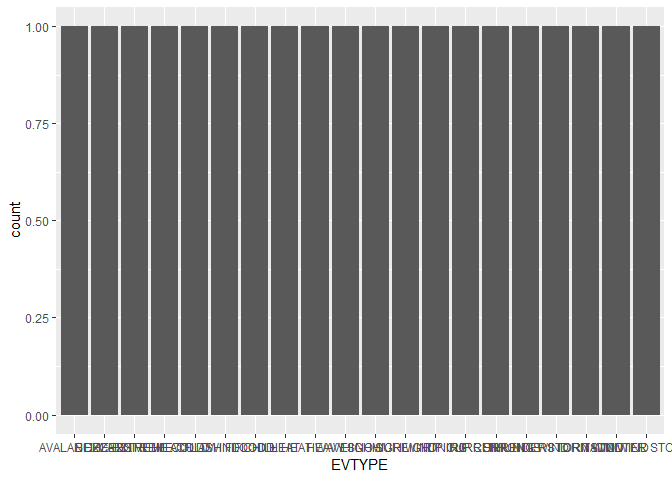

Synopsis
========

Questions Your data analysis must address the following questions: 1.
Across the United States, which types of events are most harmful with
respect to population health? How do we quantify/measure harm to
population health? (costs? probability of occurence? causes death?) What
do we mean by "most harmfu"? Causes 2. Across the United States, which
types of events have the greatest economic consequences?

Data Processing
===============

We start by downloading and importing the raw data, making use of the
**tidyverse** package.

    if(!dir.exists("./data")){
      dir.create("./data")
      fileURL <- "https://d396qusza40orc.cloudfront.net/repdata%2Fdata%2FStormData.csv.bz2"
      download.file(fileURL, destfile = "./data/repdata_data_StormData.csv.bz2", method = "auto")
    }

    storm_data <- read_csv("./data/repdata_data_StormData.csv.bz2")

We then perform a cursory exploratory data analysis to check pertinent
variables (`EVTYPE`, `FATALITIES`, `PROPDMG`, `PROPDMGEXP`, `CROPDMG`,
`CROPDMGEXP`) for missing values.

    pert_data <- storm_data %>% 
      select(EVTYPE, FATALITIES, PROPDMG, PROPDMGEXP, CROPDMG, CROPDMGEXP)

    summary(pert_data)

    ##     EVTYPE            FATALITIES          PROPDMG       
    ##  Length:902297      Min.   :  0.0000   Min.   :   0.00  
    ##  Class :character   1st Qu.:  0.0000   1st Qu.:   0.00  
    ##  Mode  :character   Median :  0.0000   Median :   0.00  
    ##                     Mean   :  0.0168   Mean   :  12.06  
    ##                     3rd Qu.:  0.0000   3rd Qu.:   0.50  
    ##                     Max.   :583.0000   Max.   :5000.00  
    ##   PROPDMGEXP           CROPDMG         CROPDMGEXP       
    ##  Length:902297      Min.   :  0.000   Length:902297     
    ##  Class :character   1st Qu.:  0.000   Class :character  
    ##  Mode  :character   Median :  0.000   Mode  :character  
    ##                     Mean   :  1.527                     
    ##                     3rd Qu.:  0.000                     
    ##                     Max.   :990.000

    pert_data %>% 
      filter(is.na(EVTYPE))

    ## # A tibble: 0 x 6
    ## # ... with 6 variables: EVTYPE <chr>, FATALITIES <dbl>, PROPDMG <dbl>,
    ## #   PROPDMGEXP <chr>, CROPDMG <dbl>, CROPDMGEXP <chr>

    pert_data %>% 
      filter(is.na(PROPDMGEXP))

    ## # A tibble: 465,934 x 6
    ##    EVTYPE    FATALITIES PROPDMG PROPDMGEXP CROPDMG CROPDMGEXP
    ##    <chr>          <dbl>   <dbl> <chr>        <dbl> <chr>     
    ##  1 TSTM WIND          0       0 <NA>             0 <NA>      
    ##  2 HAIL               0       0 <NA>             0 <NA>      
    ##  3 HAIL               0       0 <NA>             0 <NA>      
    ##  4 TSTM WIND          0       0 <NA>             0 <NA>      
    ##  5 HAIL               0       0 <NA>             0 <NA>      
    ##  6 TSTM WIND          0       0 <NA>             0 <NA>      
    ##  7 TSTM WIND          0       0 <NA>             0 <NA>      
    ##  8 HAIL               0       0 <NA>             0 <NA>      
    ##  9 HAIL               0       0 <NA>             0 <NA>      
    ## 10 HAIL               0       0 <NA>             0 <NA>      
    ## # ... with 465,924 more rows

A quick inspection shows that there are no missing values for fatalities
or event types. However, we see that there are quite a significant
number of entries with missing data on the amount of crop and property
damage. The data for each of these variables is split into two columns,
a numerical value (in dollars) and an "exponent" representing the order
of magnitude of damage (thousands, millions, or billions). It initially
appears that all those entries with missing damage exponents also
possess a value of 0 for the dollar value, suggesting that these events
resulted in no damage and that we can omit them from our analysis of the
which event types are most damaging. We validate this approximation by
verifying that all those entries with missing exponent values also
possess a zero entry for the damage value:

    pert_data %>% 
      filter( (is.na(CROPDMGEXP) & CROPDMG != 0) | (is.na(PROPDMGEXP) & PROPDMG != 0) )

    ## # A tibble: 79 x 6
    ##    EVTYPE             FATALITIES PROPDMG PROPDMGEXP CROPDMG CROPDMGEXP
    ##    <chr>                   <dbl>   <dbl> <chr>        <dbl> <chr>     
    ##  1 FLASH FLOOD WINDS           0    0.41 <NA>             0 ?         
    ##  2 TORNADO                     0    3    <NA>             0 <NA>      
    ##  3 THUNDERSTORM WIND           0    2    <NA>             0 <NA>      
    ##  4 THUNDERSTORM WINDS          0    4    <NA>             0 <NA>      
    ##  5 THUNDERSTORM WINDS          0    4    <NA>             0 <NA>      
    ##  6 FLASH FLOOD                 0   10    <NA>             0 <NA>      
    ##  7 FLASH FLOOD                 0   10    <NA>             0 <NA>      
    ##  8 FLASH FLOOD                 0   10    <NA>             0 <NA>      
    ##  9 THUNDERSTORM WINDS          0    4    <NA>             0 <NA>      
    ## 10 THUNDERSTORM WINDS          0    5    <NA>             0 <NA>      
    ## # ... with 69 more rows

We find that a small portion of the recorded storms (less than 79 out of
over 900,000) have erroneously reported property and/or crop damage. It
is not clear yet what effect excluding these entries will have on the
identifying the most damaging event type, so we will return to this
issue later.

**Is it safe to exclude these values?**

    table(storm_data$PROPDMGEXP, useNA = "ifany")

    ## 
    ##      -      ?      +      0      1      2      3      4      5      6 
    ##      1      8      5    216     25     13      4      4     28      4 
    ##      7      8      B      h      H      K      m      M   <NA> 
    ##      5      1     40      1      6 424665      7  11330 465934

Results
=======

    storm_data %>% 
      group_by(EVTYPE) %>% 
      summarise(FATALITIES = sum(FATALITIES), INJURIES = sum(INJURIES)) %>% 
      arrange(desc(FATALITIES))

    ## # A tibble: 977 x 3
    ##    EVTYPE         FATALITIES INJURIES
    ##    <chr>               <dbl>    <dbl>
    ##  1 TORNADO              5633    91346
    ##  2 EXCESSIVE HEAT       1903     6525
    ##  3 FLASH FLOOD           978     1777
    ##  4 HEAT                  937     2100
    ##  5 LIGHTNING             816     5230
    ##  6 TSTM WIND             504     6957
    ##  7 FLOOD                 470     6789
    ##  8 RIP CURRENT           368      232
    ##  9 HIGH WIND             248     1137
    ## 10 AVALANCHE             224      170
    ## # ... with 967 more rows

    storm_data %>% 
      group_by(EVTYPE) %>% 
      mutate(PROPDMG = ConvertDmg(PROPDMG, PROPDMGEXP), CROPDMG = ConvertDmg(CROPDMG, CROPDMGEXP)) %>% 
      summarise(PROPDMG = sum(PROPDMG), CROPDMG = sum(CROPDMG)) %>% 
      arrange(desc(CROPDMG))

    ## Warning in ConvertDmg(PROPDMG, PROPDMGEXP): NAs introduced by coercion

    ## Warning in ConvertDmg(PROPDMG, PROPDMGEXP): NAs introduced by coercion

    ## Warning in ConvertDmg(PROPDMG, PROPDMGEXP): NAs introduced by coercion

    ## Warning in ConvertDmg(PROPDMG, PROPDMGEXP): NAs introduced by coercion

    ## Warning in ConvertDmg(CROPDMG, CROPDMGEXP): NAs introduced by coercion

    ## Warning in ConvertDmg(CROPDMG, CROPDMGEXP): NAs introduced by coercion

    ## # A tibble: 977 x 3
    ##    EVTYPE                      PROPDMG    CROPDMG
    ##    <chr>                         <dbl>      <dbl>
    ##  1 HIGH WINDS/COLD           610000000 2005000000
    ##  2 FROST                            NA 1065000000
    ##  3 HURRICANE ERIN            358000000  146000000
    ##  4 EXCESSIVE WETNESS                NA  142000000
    ##  5 FLOOD/RAIN/WINDS                 NA  112800000
    ##  6 COLD AND WET CONDITIONS          NA   66000000
    ##  7 Damaging Freeze                  NA   64100000
    ##  8 Early Frost                      NA   42000000
    ##  9 SEVERE THUNDERSTORM WINDS    175000   29000000
    ## 10 Extreme Cold                     NA   20000000
    ## # ... with 967 more rows

    storm_data %>% 
      group_by(EVTYPE) %>% 
      summarise(FATALITIES = sum(FATALITIES), INJURIES = sum(INJURIES)) %>% 
      arrange(desc(FATALITIES)) %>% 
      filter(FATALITIES > 100) %>% 
      ggplot(data = ., mapping = aes(x = EVTYPE)) + 
      geom_bar()

